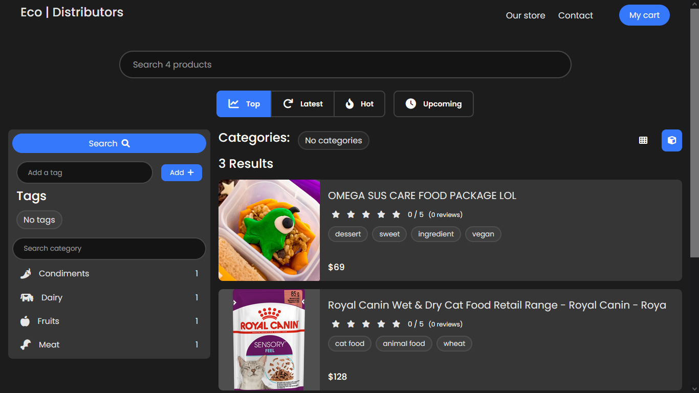

# EcoDistributors

A mini E-commerce app.

## Home

## Product

## Cart

### How to run locally

- Clone this repo.
- Open `./frontend` & run `npm install`.
- Install `django` + it's dependencies.
- Open `./commands` & open all `.bat` files.
